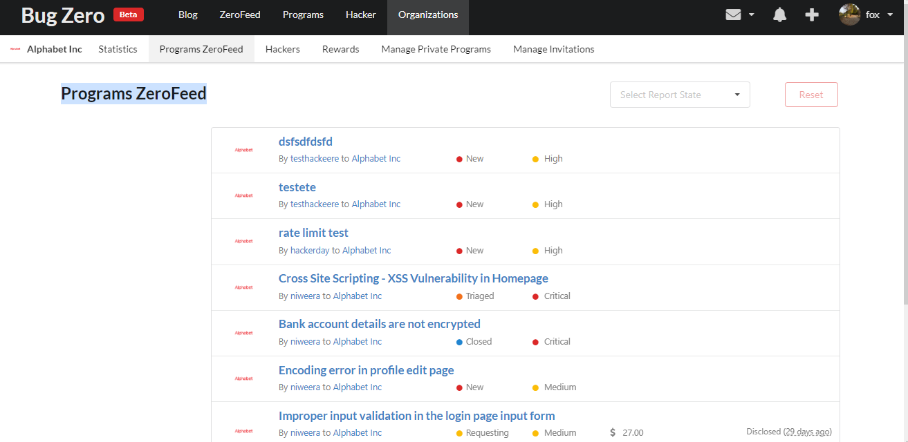

# User Management

You can visit to Organization Settings > User Management to manage your team members. You may control every user in your organization from here.

### Adding a user to the organization 

To add a new user to your organization:

1. Go the **Organizations > User Management**
2. Click on "Add User"
3. Provide the user handle of the user that should be invited
4. Select the groups the user should be added to.&#x20;
5. Click on "Add User" at the bottom of the page to finish

### Removing a user from the organization 

To remove a user from the organization:

1. Go the **Organization Settings > User Management**
2. Find the user that you want to remove
3. Click the remove user to delete the user from the organization

<figure><figcaption></figcaption></figure>

### Manage Groups

To manage the access of the user:

1. Go the **Organization Settings > User Management**
2. Find the user that you want to remove
3. Click the manage groups from the organization
4. .Tick Standard or Admin

<figure><figcaption></figcaption></figure>
